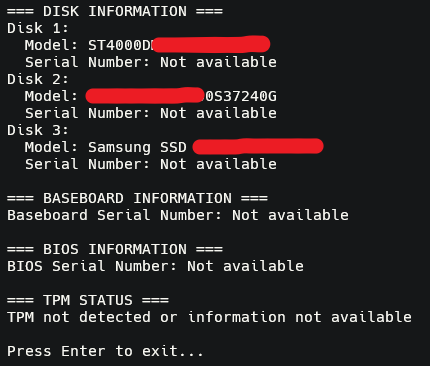
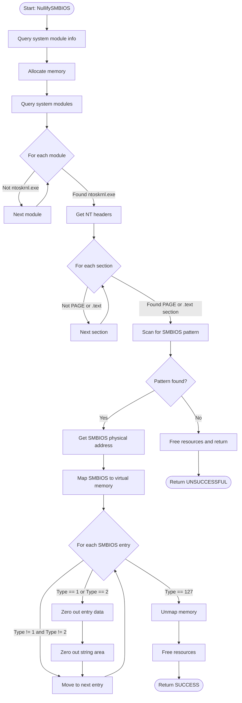
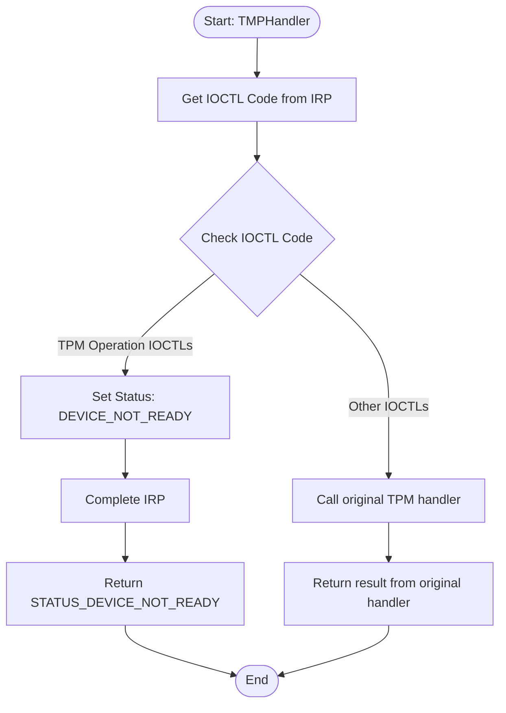
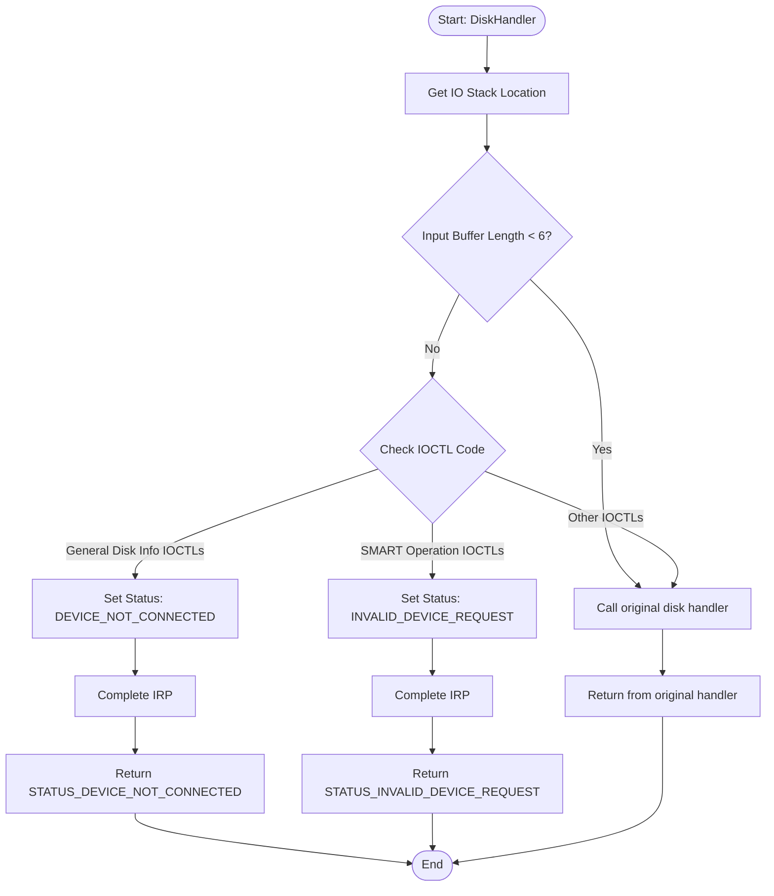
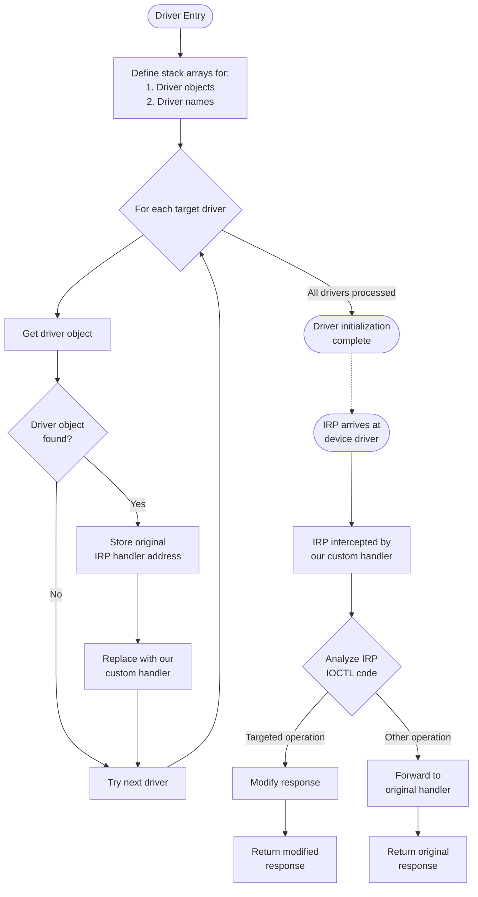

<h1 align="center">✨ Battleye HWID Spoofer ✨</h1>

<h6 align="center"><em>Battleye Hardware ID Spoofer Kernel-Mode Driver</em></h6>

## 📝 Overview

This project is my battleye HWID spoofer driver, it wipes hardware devices' serial numbers.<br>
The driver still works on both windows 10 and 11 as of writing this.

However, I want to emphasize that doing this is against battleye's TOS.<br>
I don't condone the usage of this driver, use it at your own risk.

The project was made for learning purposes, not for maliscious intent.

## ✨ Features

- Spoofs disk drives (C:\\), all disk drives supported
- Spoofs TPM (Trusted Platform Module) as disabled
- Spoofs SMBIOS tables 1 and 2

- Thoroughly documented
- Highly robust & efficient
- Visualizer to ensure successful spoofing
- Supports all recent Windows 10 & 11 versions

## 🚀 Installation

### 🎉 Pre-Compiled

To avoid compiling from source,<br>
download a precompiled version here:

| Binary | Download |
|:--------|:-------|
| Visualizer | [Visualizer.exe](https://github.com/DontCallMeLuca/Battleye-HWID-Spoofer/releases/download/v1.0/Visualizer.exe) |
| Driver | [Battleye-HWID-Spoofer-Driver.sys](https://github.com/DontCallMeLuca/Battleye-HWID-Spoofer/releases/download/v1.0/Battleye-HWID-Spoofer-Driver.sys) |

----------

### ⚙ Compile from source

1. Install requirements:

- [Visual Studio 2022](https://visualstudio.microsoft.com/vs/community/) or above
- [WDK](https://learn.microsoft.com/en-us/windows-hardware/drivers/download-the-wdk)
- [WSDK](https://developer.microsoft.com/en-us/windows/downloads/windows-sdk/)

2. Clone the repository:

```sh
git clone https://github.com/DontCallMeLuca/Battleye-HWID-Spoofer.git
```

3. Open the project:

Open [Battleye-HWID-Spoofer-Driver.sln](./Battleye-HWID-Spoofer-Driver.sln) using Visual Studio

4. Verify setup:

- The C++ standard should be C++20.
- The build mode should be Release x64.

5. Compile:

On the side panel, right click on the project (driver or visualizer) and click "Build".<br>
You should find the binaries in the `x64/Release` directory.

## 💻 Usage

You will need a vulnerable driver mapper of some kind to load the driver into kernel mode.
Once the driver is loaded, the spoofing will have already happened. You can use the [Visualizer.exe](https://github.com/DontCallMeLuca/Battleye-HWID-Spoofer/releases/download/v1.0/Visualizer.exe) program to verify that everything was successful. Finally, you can safely start your Battleye protected game.

## ✅ Proof of Concept

| Spoofer Active (Using Visualizer.exe) |
|:-------------------------------------:|
|  |

## 🛠 Technical Details

One of the primary exploited flaws of Battleye is that it runs after the game launchers, not at system startup like stricter anticheats such as Riot Games' Vanguard. This allows bad actors to exploit regular kernel vulnerabilities without the anticheat overseeing it.

In our case, the driver attempts to modify critical system structures to avoid Battleye's hardware id based banning. Essentially allowing you to get caught by Battleye, and not suffer a ban.

### SMBIOS Nullification

The System Management BIOS (SMBIOS) specification, managed by the DMTF (Distributed Management Task Force), defines data structures that contain detailed information about computer hardware components. This information includes:

- System manufacturer details
- Product names
- Serial numbers
- Motherboard information
- Other unique identifiers

#### For Example:

```
	+----------------------+  <- entry (SMBIOS_HEADER)
	| Fixed-size header    |
	+----------------------+
	| String 1 ("ASUS")    |  <- Null-terminated
	| \0                   |
	| String 2 ("ROG")     |  <- Null-terminated
	| \0                   |
	| String 3 ("123456")  |  <- Null-terminated
	| \0                   |
	| \0  <- Double null   |  <- End of entry
	+----------------------+
	| Next SMBIOS entry    |  <- New entry starts here
	+----------------------+
```

---------

Battleye relies on SMBIOS data to identify and track systems.<br>
The driver attempts to counter this by zeroing out specific SMBIOS entries.

#### This is done by:

1. Locating the Windows kernel (ntoskrnl.exe) in memory
2. Searching for a specific byte pattern that references the SMBIOS table
3. Mapping the physical SMBIOS table into virtual memory
4. Zeroes out Type 1 (System Information) and Type 2 (Baseboard Information) entries

#### Visualizing:



#### Pattern Scanning Technique

The function uses a pattern scanning approach to find the SMBIOS table pointer within the kernel.
The pattern corresponds to specific x86-64 assembly instructions that reference the SMBIOS table within the Windows kernel.

The assembly byte sequence it looks for is as follows:

```asm
MOV RCX, [RIP + offset]		; Load a global pointer
TEST RCX, RCX				; Check if it's NULL
JZ location					; Jump if NULL
MOV EDX, [RIP + offset]		; Load value
```

This effectively locates the SMBIOS' relative address in virtual memory.

#### SMBIOS Table Navigation

In order to iterate through each entry, it's important to understand the structure of the SMBIOS.
For more info on this, please see the [DMTF SMBIOS Standard](https://www.dmtf.org/standards/smbios).
It will provide a detailed overview on how one can navigate it.

In the function, we know that if the entry's type is of value 127, then we know we've reached the end of the structure. Therefore, we can iterate until we find it.

For each entry, we get the string area using the base address of the entry and it's length.
Once found, we can calculate the length of the string area. We know the area consists of null-terminated strings, except for the last string in the entry which is terminated by two consecutive null-terminators. Because of this, we can iterate and increment the length by each string we find, checking the next if we only find one null-terminator, once we find two, we know we've reached the end of the entry.

We can then set the memory area of the entry to `0`, effectively nullifying the entry.

### TMP Device Control Interception

The Trusted Platform Module (TMP) is a specialized hardware chip present in modern computing devices.

You can find further specifications [here](https://trustedcomputinggroup.org/wp-content/uploads/Trusted-Platform-Module-Summary_04292008.pdf).

#### It Provides:

- Secure storage of cryptographic keys
- Platform authentication mechanisms
- Hardware-based security attestation
- Anti-tampering features for sensitive data

TMP chips are central to various Windows security features, for our purposes, we are interested in hardware level integrity verification.

The function is an IRP (I/O Request Packet) handler that intercepts device I/O control codes (IOCTLs) sent to the TPM device.

#### The function works by:

1. Examining incoming I/O Request Packets (IRPs) directed to the TPM device
2. Checking if the IOCTL code matches any of six critical TPM operations
3. If matched, immediately returning `STATUS_DEVICE_NOT_READY`
4. For non-matched IOCTLs, the IRP is forwarded to the original TPM handler

#### Intercepted TPM Operations

| IOCTL Code | Operation | Purpose |
|------------|-----------|---------|
| 0x22C194 | TMP_GET_INFO | Retrieves TPM device information |
| 0x22C004 | TMP_READ_DATA | Reads data from the TPM |
| 0x22C010 | TMP_GET_VERSION | Gets TPM firmware version |
| 0x22C01C | TMP_SEND_COMMAND | Sends commands to the TPM |
| 0x22C014 | TMP_GET_CAPABILITY | Queries TPM capabilities |
| 0x22C00C | TMP_EXECUTE_COMMAND | Executes TPM commands |

#### Visualizing:



### Disk Drive Device Control Interception

Similar to the TMP, storage devices in Windows expose their functionality through various Input/Output Control (IOCTL) interfaces.

#### The driver attempts to:

1. Examining incoming I/O Request Packets (IRPs) directed to disk devices
2. Validating that the input buffer length is at least 6 bytes
3. Checking if the IOCTL code matches any targeted disk operations
4. For standard disk information requests, returning `STATUS_DEVICE_NOT_CONNECTED`
5. For SMART-related operations, returning `STATUS_INVALID_DEVICE_REQUEST`
6. For non-matched IOCTLs, the IRP is forwarded to the original disk handler.

#### General Disk Information (Returns STATUS_DEVICE_NOT_CONNECTED):

| IOCTL Code | Operation | Purpose |
|------------|-----------|---------|
| 0x4D004 | IOCTL_SCSI_PASS_THROUGH | Sends commands directly to SCSI devices |
| 0x70000 | IOCTL_DISK_GET_DRIVE_LAYOUT | Retrieves partition information |
| 0x70050 | IOCTL_DISK_GET_DRIVE_GEOMETRY | Gets physical disk characteristics |
| 0x70140 | IOCTL_DISK_GET_PARTITION_INFO | Retrieves partition details |
| 0x4D014 | IOCTL_SCSI_PASS_THROUGH_DIRECT | Direct SCSI command access |
| 0x2D1400 | IOCTL_STORAGE_QUERY_PROPERTY | Queries storage device properties |
| 0x2D5100 | IOCTL_STORAGE_GET_HOTPLUG_INFO | Gets removable media information |
| 0x2D1080 | IOCTL_STORAGE_GET_DEVICE_NUMBER | Retrieves device identifier |
| 0x2D1440 | IOCTL_STORAGE_GET_MEDIA_TYPES_EX | Gets supported media types |
| 0x2D0C14 | IOCTL_STORAGE_GET_MEDIA_SERIAL_NUMBER | Retrieves disk serial number |

#### SMART Operations (Returns STATUS_INVALID_DEVICE_REQUEST):

| IOCTL Code | Operation | Purpose |
|------------|-----------|---------|
| 0x74080 | SMART_GET_VERSION | Gets SMART capability version |
| 0x740C8 | SMART_RCV_DRIVE_DATA | Retrieves SMART health information |
| 0x74084 | SMART_SEND_DRIVE_COMMAND | Sends SMART commands to disk |

#### Visualizing:



### Device IRP Handler Interception

Our IRP handlers need to intercept the devices' IRPs. In order to do this, our main driver entry point needs to redirect the packets to our own handlers.

To do this, we define two stack arrays, one which will store the driver objects for our targeted devices (TMP & disks) and the other which will store the name for the targeted drivers.

We then use a forwardly declared function `ObReferenceObjectByName`, which normally hidden and undocumented, to get the driver objects. We can then store the driver objects' IRP handler functions so that we can call them later, and replace their address with our own handlers.

This effectively allows us to redirect the IRP traffic to our own handlers.

#### Visualizing:



## ⚠ Limitations

- Not maintained
- Windows only
- Doesn't spoof all devices
- Not foolproof (nothing ever is)

## 📃 License
This project uses the `GNU GENERAL PUBLIC LICENSE v3.0` license
<br>
For more info, please find the `LICENSE` file here: [License](LICENSE)
